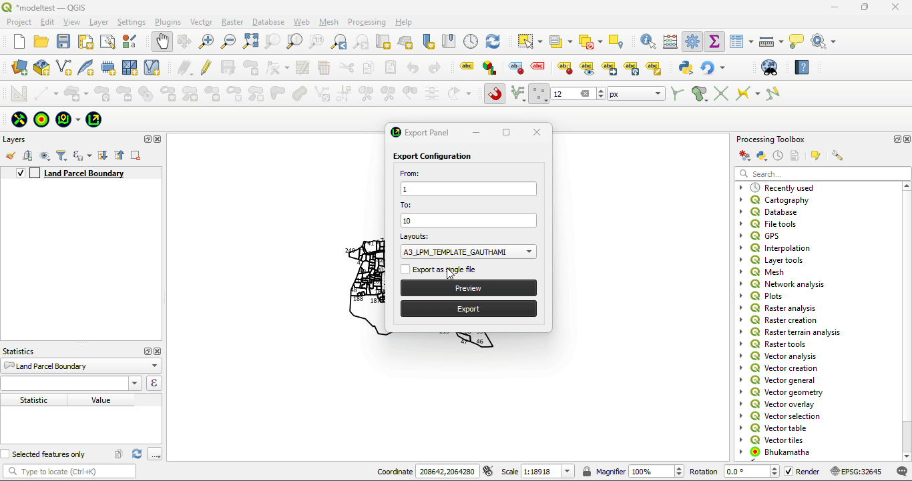
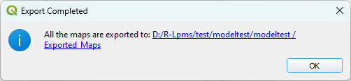

# Export Panel

Export Panel will help you in Preview (or open the existing Layouts) in the project and also Export the Maps based on existing Layout(s).

## From and To

**From** and **To** value enables the filtering in the Maps for Atlas enabled layouts, for non Atlas layouts it won't works.

- **From** value takes the Lower Limit of the filtering criteria
- **To** value takes the Upper Bounding Limit of the filtering criteria

:::info

**From** and **To** Takes only the **Numbers** as inputs

:::

## Layouts

Dropdown shows all the list of available(added) Layouts in the Projects.

- On click the layout drop-down open with all the added Layouts in the project
- Click on the preferred Layout to select.

## Preview (Button)

On click **Preview** button it open the selected Layout

## Export (Button)

Export Button provides the functionality of exporting the Maps

- On click **Export** it start exporting Maps

- Progress indicator start once the exporting has started
  

- After completion of exporting Exported location will be shown along with completed message

:::info Export Location

All the Maps exported via export panel are Exported into **Exported_Maps** folder inside your Project folder

:::

## Points to Remember

- if **Export as a single file** is checked all the Maps will be exported into a single file with layout name irrespective of Atlas settings
- To export all the Maps of **Atlas** layout keep the **From** and **To** values blank else it export Maps based on the values
- For non Atlas Layouts it won't consider From and To values, export the map with Layout Name and also same for Reports
