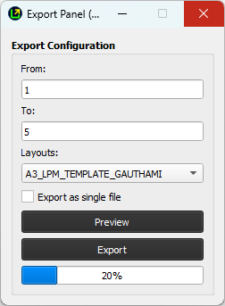

# Export Panel

:::warning  
This documentation is primarily generated by AI and may contain inaccuracies or incomplete information. A thorough manual review is still pending. Please [Report](../../feedback) any errors, inconsistencies, or suggestions for improvement to ensure accuracy and reliability.
:::

The **Export Panel** allows you to preview and export maps based on the existing layouts in your project. This feature is especially useful for working with **Atlas-enabled layouts** and exporting maps in a structured manner.

## From and To Fields

The **From** and **To** fields are used to filter maps for **Atlas-enabled layouts**. These fields do not affect non-Atlas layouts.

- **From**: Specifies the lower limit of the range for filtering maps.
- **To**: Specifies the upper limit of the range for filtering maps.

> **Note**:
>
> - The **From** and **To** fields accept only **numeric values**.
> - For non-Atlas layouts, these fields are ignored, and all maps will be exported as defined by the layout.

**From and To Filters** are helpful when working with **Atlas-enabled layouts** for exporting a specific range of maps based on a given criterion.

## Layouts Dropdown

The **Layouts** dropdown displays all the layouts that have been added to your project. You can choose which layout you want to use for previewing or exporting maps.

- **How to use**:  
  Click on the dropdown to see the list of available layouts in the project.
  - Select the layout you want by clicking on its name.

## Preview Button

The **Preview** button allows you to view the selected layout before exporting.

- **How to use**:  
  Click the **Preview** button to open the selected layout and review the map as it will appear once exported.

## Export Button

The **Export** button starts the process of exporting maps based on the selected layout.

- **How to use**:  
  Click the **Export** button to begin the map export process.
  
  - A progress bar will appear to indicate that the export is in progress.
  
  

- **Completion**:  
  After the export is complete, a confirmation message will appear along with the location of the exported files.
  
  

**Export Location**:  
All exported maps are saved in the **Exported_Maps** folder, which is located inside your project's main directory.

## Important Considerations

Here are some key points to remember when using the **Export Panel**:

- **Export as a single file**:  
  If you check the **Export as a single file** option, all maps will be exported into one file, regardless of Atlas settings. The file will be named according to the layout.

- **For Atlas Layouts**:
  
  - If you leave the **From** and **To** fields empty, all maps in the Atlas layout will be exported.
  - If you enter specific values in the **From** and **To** fields, only maps within that range will be exported.

- **For non-Atlas Layouts**:  
  The **From** and **To** fields are ignored. The maps will be exported based on the selected layout, and each map will be saved using the layout name.

- **Reports**:  
  The same rules for **Atlas** and **non-Atlas layouts** apply to reports. They are exported based on the selected layout, and **From** and **To** values do not affect non-Atlas reports.
