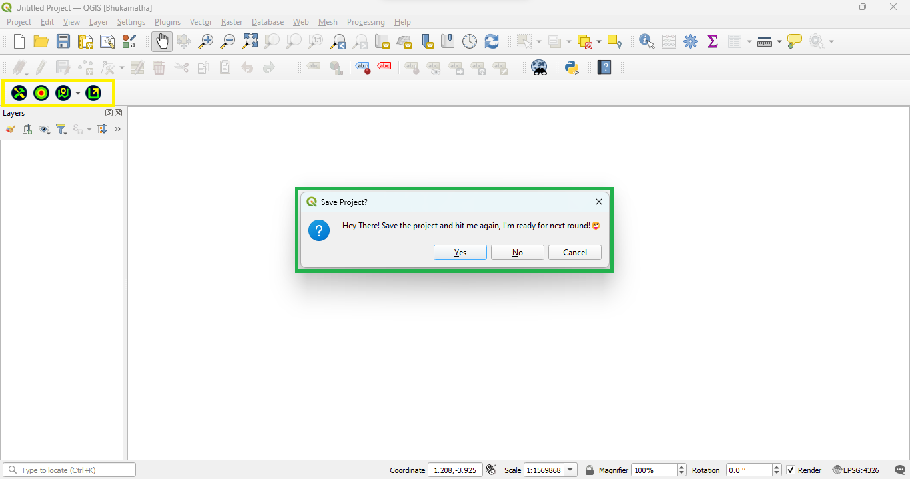
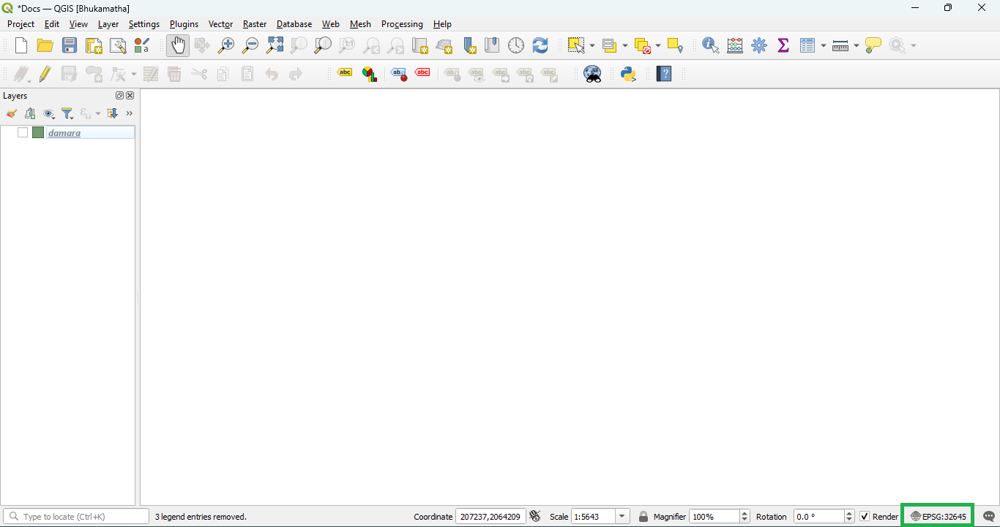

# Steps to Rembember

## Save the Project

Save the Project for Bhukamtha to work as intended (as Bhukamtha is dependent on the project sources)

To save the project use shortcut **Ctrl+S** or use the save icon in the toolbar 

Clicking on any icons of the Bhukamatha on unsaved project will prompt you for save the project 

## Set Projection

Proper Zone selection for the project and for Layers is important and must do step

